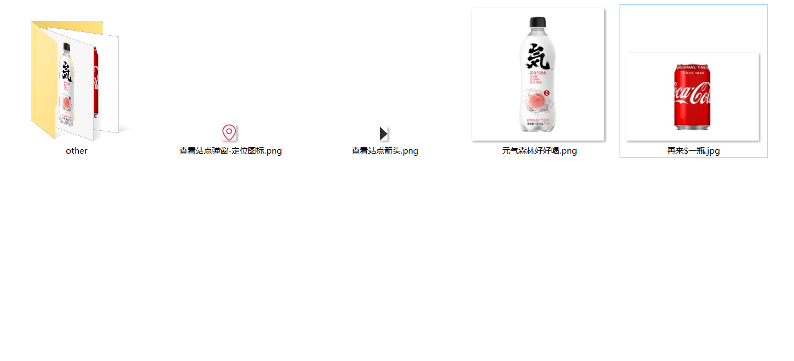
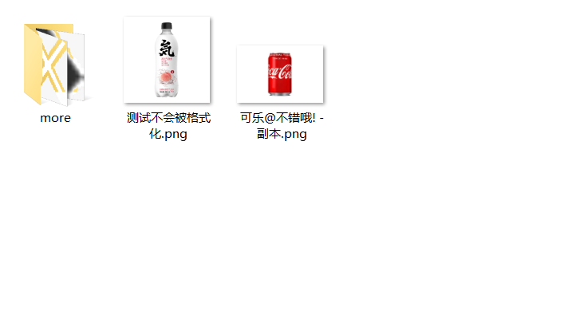
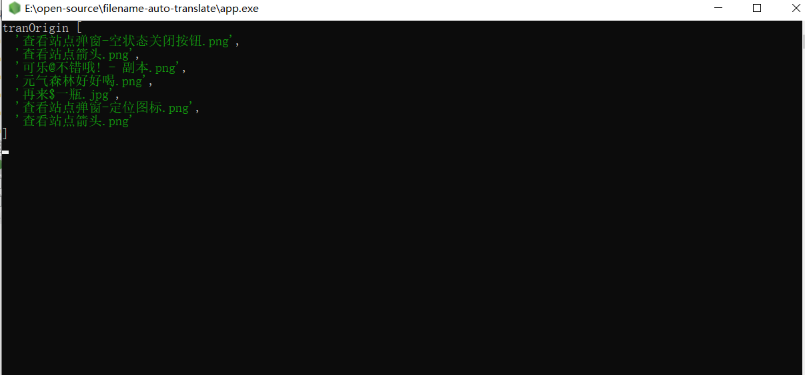
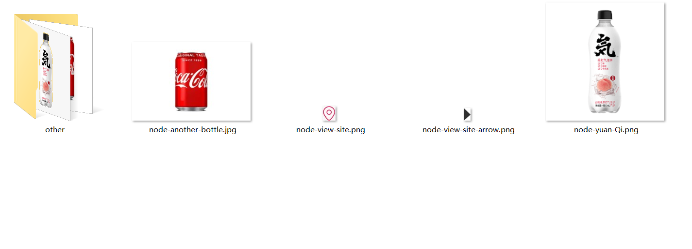
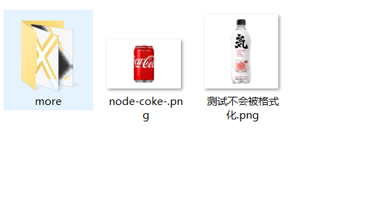

## 设计师给的切图命名不规范，让我一键用Node.js给他规范！

主要用于蓝湖等切图工具导出的中文文件名批量转为英文文件名，支持定制化、规范化

## 解决痛点
1.  在我们日常开发中设计师给的图很有可能一堆中文命名的文件，拿到我们的手中还要转一遍英文，数量少可能还好，数量一多那就挺折磨人的。
2.  万一遇到自己不会的英文单词，还要去百度翻译，也挺浪费时间的。当然你纯拿这个工具处理其他文件来翻译也是可以的。

## 核心

```js
/**
 * @description  文件操作
 */

const fs = require('fs')
const path = require('path')
const { isChina } = require('../utils/index')
const options = require('../options/index')

const { canFormat, entry, exclude } = options
const tranPath = path.join(process.cwd(), '/', entry)

/**
 * 读取指定目录文件夹下的文件名
 * 
 * @returns string[] 返回原始文件名数组
 */
exports.readFile = () => {
  let tranList = []
  function getTranList (tranPath) {
    const readDir = fs.readdirSync(tranPath);
    for (let index = 0; index < readDir.length; index++) {
      const filename = readDir[index];
      let destUrl = path.join(tranPath, '/', filename)
      let stats = fs.lstatSync(destUrl)

      if (stats.isDirectory()) {  //如果是文件夹递归处理
        getTranList(destUrl)
      } else {
        //校验
        if (canFormat.findIndex(suffix => filename.includes(suffix)) > -1 && isChina(filename)) {
          if (exclude.length > 0 && exclude.some(item => filename.includes(item))) {
            continue
          }
          tranList.push(filename)
        }
      }
    }
  }
  getTranList(tranPath)

  return tranList
}

/**
 * 用于改变文件夹的名字
 * 
 * @param {Object} tranInfo 
 * @returns 
 */
exports.changeFilename = (tranInfo) => {
  let { tranOrigin, tranRight, newTranList } = tranInfo //tranOrigin 原始   tranLeft 后缀前 tranRight 后缀后 newTranList 翻译后
  console.log(tranOrigin, tranRight, newTranList);
  if (!tranOrigin || !tranOrigin.length) return

  function getChange (tranPath) {
    const readDir = fs.readdirSync(tranPath);
    readDir.forEach(filename => {
      let destUrl = path.join(tranPath, '/', filename)
      let stats = fs.lstatSync(destUrl)
      if (stats.isDirectory()) {
        getChange(destUrl)
      } else {
        //查找对应的翻译结果
        let id = tranOrigin.findIndex(name => name === filename)
        if (id > -1) {
          fs.rename(destUrl, tranPath + '/' + newTranList[id] + '.' + tranRight[id], (err) => {
          })
        }
      }
    })
  }
  getChange(tranPath)
}

```
先通过fs.redderSync同步读取当前目录下的所有文件，通过fs.lstatSync区分文件名是文件夹还是文件，如果是文件夹，那么就递归读取文件名。通过一个数组收集所有的文件名，注意需要做校验。

```js
/**
 * 开始翻译
 * 
 * @param {string[]} tranOrigin 原始文件夹下的文件名信息
 * @returns Object 文件名信息集合
 */
const openTranslate = async (tranOrigin) => {
  if (JSON.stringify(tranOrigin) === '[]') console.log("不存在中文文件名");
  let tranLeft = tranOrigin.map((item) => item.split('.')[0])
  const tranRight = tranOrigin.map((item) => item = item.split('.')[1])
  const translate = new MysKeyTranslate({
    appid: auth.appid,
    secret: auth.secret,
  });

  String.prototype.trim = function () {
    return this.replace(/(^\s*)|(\s*$)/g, "");
  }

  let tranSrc = tranLeft.join('￥')
  let res = await translate(tranSrc, { to: 'en' })
  let newTranList = res.split('￥')

  function formats (s) {
    var pattern = new RegExp("[`~!@#$^&*()=|{}':;',\\[\\].<>/?~！@#￥……&*（）——|{}【】‘；：”“'。，、？]")
    var rs = "";
    for (var i = 0; i < s.length; i++) {
      rs = rs + s.substr(i, 1).replace(pattern, '');
    }
    return rs;
  }
  //格式化
  let newTranListTrim = newTranList.map(item => {
    let res = item.replace(/(^\s*)|(\s*$)/g, "");
    if (!specialStr) {
      res = formats(res)
    }
    let arr = res.split(' ')
    if (arr.length > maxSeparator) {
      arr.splice(maxSeparator - 1, arr.length - 1)
    }
    let str = arr.join(separator)
    return itemPrefix ? itemPrefix + separator + str : str
  })

  return { tranOrigin, tranLeft, tranRight, newTranList: newTranListTrim }
}

module.exports = openTranslate

```

然后通过第三方的翻译接口一次性获取翻译的结果。这里通过百度翻译的api，可以自行去官方免费获取密钥和appid，对结果做一层数据校正，然后根据原始的文件名的数组下标，找到对应的翻译结果，通过fs.rename进行重命名。

```js
const options = {
  canFormat: ['.jpg', '.png'],  //支持的文件名
  itemPrefix: 'node',
  separator: '-', //文件名的分割符号
  exclude: ['测试'], //如果文件名包含会被排除
  specialStr: false,   //是否允许特殊字符, 默认不允许
  auth: {     //使用者需要去官方申请密钥，开发者用户可以免费获取限流的api翻译接口
    appid: '20220609001243142',
    secret: '7ck5ZZEKepsN7GZLthKo'
  },
  entry: 'images', //入口
  maxSeparator: 3,
}

module.exports = options
```
后期为了方便维护使用，配置了格式化、规范化的配置。如过滤、前缀、分隔符、特殊字符处理、 入口、最大分割数。

最后为了实现一键修改，通过pkg打包成app.exe使用。

## 使用方法
```js
  npm i 
  npm run  pkg //这个时候根目录会生成app.exe的文件
```
使用app.exe文件放入需要转换的根目录，将需要转换的图片文件（支持jpg、png）放入images文件夹中，点击后可以一键中文翻译英文。


## 示例






